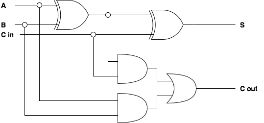
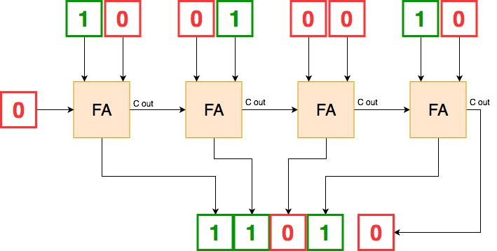

# booleang

A structured boolean-logic programming language. It uses a completely different
paradigm from any other language I've seen before, so it might be difficult to
actually use it. The main purpose is for experimenting with boolean logic and
logic circuits, and possibly also for testing the logic behind real life
circuits.

## Example

```
circuit main () -> () {
    # set a to low
    0 -> a;

    # output a
    obit(a);

    # a 1Hz clock
    clock 1s {
        # flip a
        ¬a -> a;
    }
}
```

This example defines a variable `a` which is initally set to `0`.
A variable can either be `1` or `0`.

`a` is outputted using the `obit` builtin function, which means that it
will be persistantly displayed to the terminal. Running the program will produce
this output:

```
a = 0
```

Any other outputted variables would be displayed below.

After outputting it, a 1Hz clock is started. Every second, `a` is flipped,
so `0` will turn into `1` and vice versa. The cool thing about booleang is that
the output changes, so instead of saying `a = 0`, it will change to say:

```
a = 1
```

Since `a` retains its state, you could think of it as a D-type flip-flop if you
were to recreate the circuit in real life.

## Operators

Booleang supports all the logic operators you'd expect:

```
circuit main () -> () {
    # and, or, xor, not
    a & b -> c;
    a | b -> c;
    a ^ b -> c;
    !a -> b;

    # unicode equivalents
    a ∧ b -> c;
    a ∨ b -> c;
    a ⊻ b -> c;
    ¬a -> b;
}
```

It's very likely that more will be added in the future. NAND, for example.

## Circuits

You've already seen a circuit in the first example of this document. A circuit
is basically a function, but called a circuit instead to fit in with the
logic circuit theme, and also to emphasise the differences. Like functions,
circuits can take arguments. But, unlike functions in most other languages,
they return values to specific variables too. Look at this example:

```
circuit invert (a) -> (b) {
    ¬a -> b;
}
```

It's a very simple circuit which takes an argument, `a`, and stores the inverse
of it in the output parameter `b`. Think of this circuit like a NOT gate:


You could call the above `invert` circuit using this syntax:

```
circuit main () -> () {
    0 -> x;
    invert (x) -> y;
    obit(y);
}
```

Also, note: output parameters from circuits don't have to be existing variables.
If they aren't already defined, they will be created in the calling scope.

Circuits can have any number of input or output parameters. In
[booleang.bl](booleang.bl), you can see an example of a
[full adder](https://en.wikipedia.org/wiki/Adder_%28electronics%29#Full_adder)

## Macros

It may seem quite unwieldy for all variables to be a single bit, but in practice
it doesn't matter. Of course, Booleang isn't really a general purpose language,
but either way, you can actually represent any digital data using a number of
bits. For example, the number 9 could be represented as 4 bits. In the example
below, the number 9 is represented using four variables, `b0` being the least
significant bit and `b3` being the most.

```
circuit four () -> () {
    1 -> b0;
    0 -> b1;
    0 -> b2;
    1 -> b3;
}
```

Four lines just to make a number? Seriously?? No - of course not. This is a
perfect use case for _macros_. Macros are used to group together sets of bits
into one name.

```
circuit four () -> () {
    %four (b0, b1, b2, b3);
    (1, 0, 0, 1) -> %four;
}
```

This piece of code does the exact same thing, but in half the space.

## Numbers

Once you have a number (see Macros above), what can you do with it? Well, you
could output it.

```
circuit outputting (b0, b1, b2, b3) -> () {
    %num (b0, b1, b2, b3);
    onumu(%num);
}
```

The `onumu` function stands for "output number unsigned", and interprets all of
its inputs as the bits, from least significant to most significant, as an
unsigned integer. If your number is signed, use `onums` (for "output number
signed") to output it - it is assumed that signed numbers use two's complement.

### Arithmetic

Say you have two integers, `%a` and `%b`. How would you add them?

Inside a computer, numbers are added using full adder circuits. Full adders
take two bits and a carry, `C in`, and output a sum and another carry, `C out`.
A full adder looks like this:



Here's the same thing written in Booleang. If you've downloaded the interpreter,
see if you can write it yourself without looking.

```
circuit adder (a, b, cin) -> (sum, cout) {
    (a ^ b) ^ cin) -> sum;
    ((a ^ b) & cin) | (a & b) -> cout;
}
```

Then, to actually add the two integers, you'd make a circuit something like
this:



This might look quite complicated at first. The orange boxes labelled "FA" are
full adders, as in the previous circuit diagram. The left input is `C in`,
and the top two are `A` and `B` (though technically it doesn't matter what order
they're in). The right output is `C out`, and the bottom one is `S`.

The numbers along the top are the the bits of the numbers 9 and 2 - each pair
contains one bit from each number. Somewhat comfusingly, both the input numbers
and the output (at the bottom) are in the reverse order of what you'd expect.

The bits along the bottom are the output. The rightmost output bit is the carry,
and isn't in the same order as the other bits (just to confuse you even more).
Since the numbers are in reverse order, the output would be read as `01011`,
which is of course the binary representation of 11, which is 9 + 2.

Now try to recreate this circuit in Booleang; or, just copy the code below:

```
circuit add4 (a0, a1, a2, a3, b0, b1, b2, b3) -> (s0, s1, s2, s3, carry) {
	adder (a0, b0, 0) -> (s0, c0);
	adder (a1, b1, c0) -> (s1, c1);
	adder (a2, b2, c1) -> (s2, c2);
	adder (a3, b3, carry) -> (s3, c3);
}
```

Recall that `a0` is used to denote the least significant bit of the number. And
there you have it, a 4-bit adder using just a few AND and OR gates. As a fairly
trivial exercise, try converting this to an 8-bit adder and see if it still
works.
